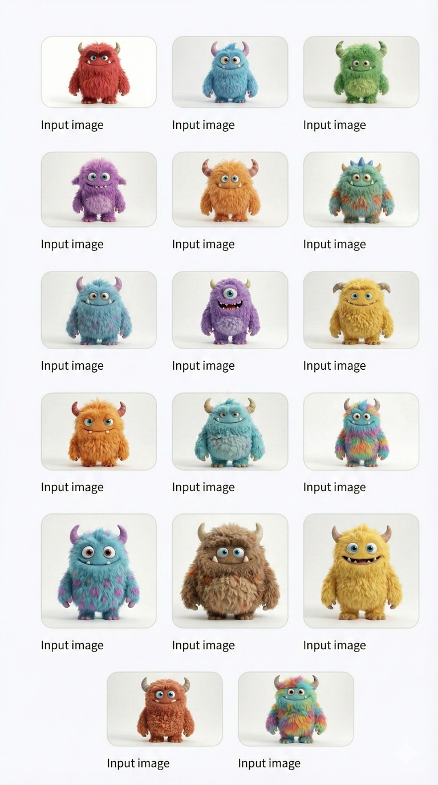
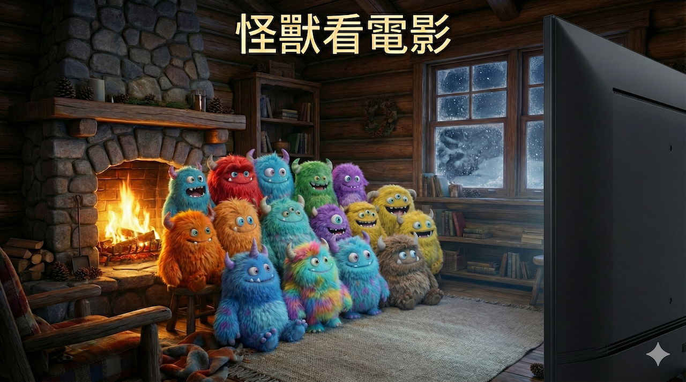
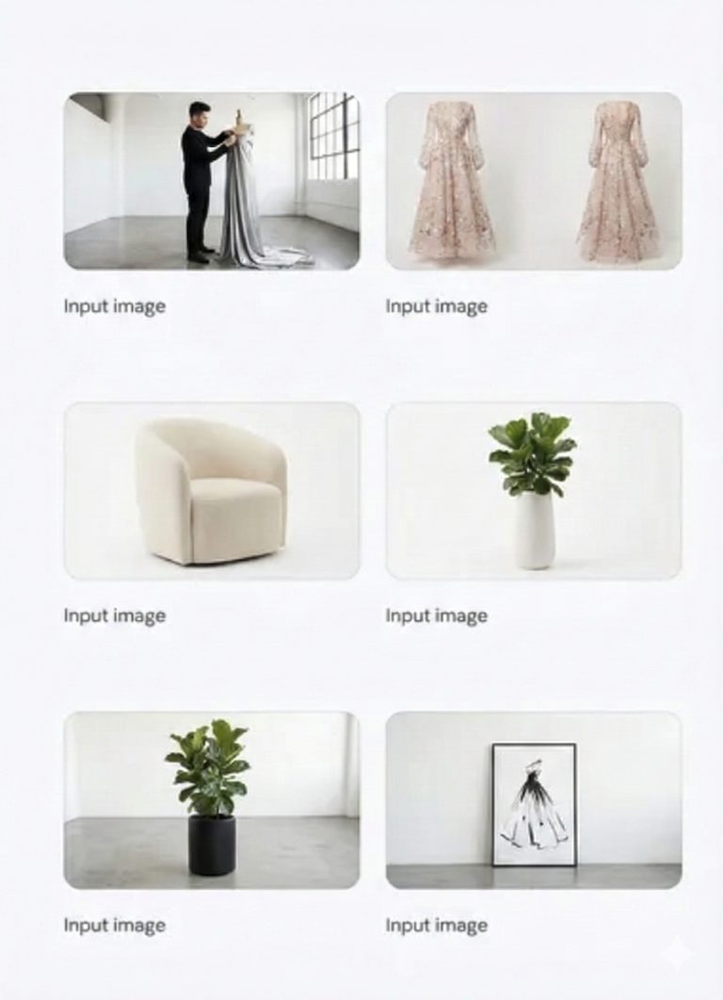
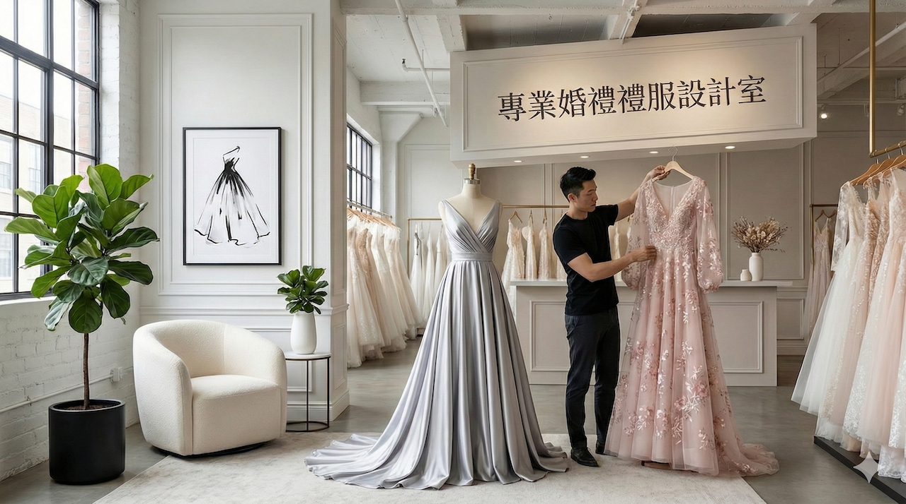

# 運用升級的創意能力，打造高真實視覺效果

## 多張圖片的合成

**設計上的一致性**:Nano Banana Pro 讓您以前所未有的方式融合更多元素，最多可同時使用 14 張影像，並保持最多 5 位人物的一致性和相似度。無論是將草圖轉化為產品，還是將藍圖轉化為逼真的 3D 模型，您現在都能輕鬆彌合概念與創作之間的鴻溝。您可以輕鬆地將所需的視覺效果應用於模型，確保您的品牌形像在所有接觸點上保持無縫且一致。

## 範例(14個素材的合成)

**prompt**
```
[提示：]請將14張素材合成一張圖片

[情境:]
1. 在一個小木屋內
2. 天氣寒冷,室內有火爐
3. 有一張溫暖的沙發
4. 14個怪獸正在沙發上,正在看一個電影,前面是一台舊時代的電視機,內容不重要
5. 電視很大台,不用顯示電視畫面,只顯示電視的一側邊
6. 畫面重點是14個怪獸的表情和神韻 

[標題:]怪獸看電影

[注意事項:]
- 請使用16:9版面
- 請使用繁體中文

[目的:]
- 看板

```

| 來源 | 圖解 |
|:--|:--|
|  |   |


## 範例(1個主題和5個素材)

**prompt**

```
[提示：]請將1個主題和5個素材合成一張圖片

[主題:]
1. 請使用人物的房間
2. 人物請使用素材提供的男士圖片
3. 人物正在整理婚禮禮服
4. 婚禮禮服使用素材提供的禮服
5. 其它的4個素材當作房間的裝飾
6. 一個專業的婚禮禮服房間

[注意事項:]
- 請使用16:9版面
- 請使用繁體中文

[目的:]
- 看板

```

| 來源 | 圖解 |
|:--|:--|
|  |   |
