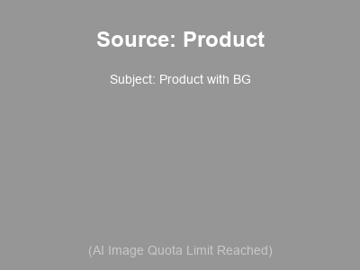
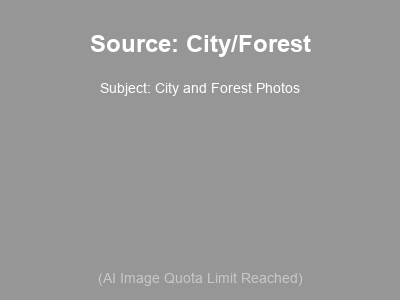
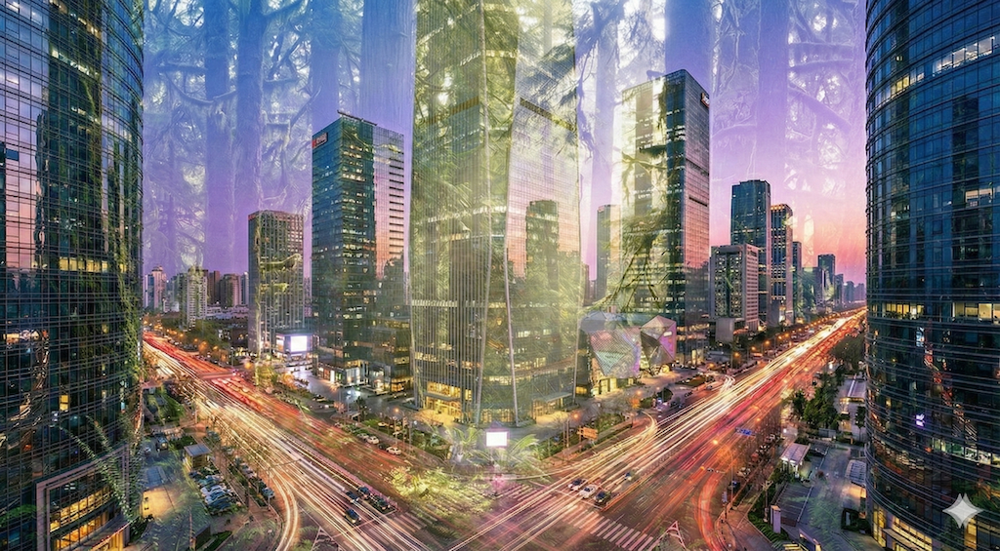
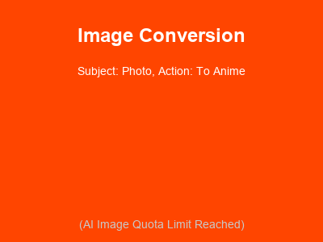
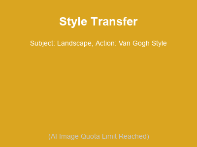
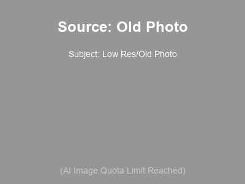
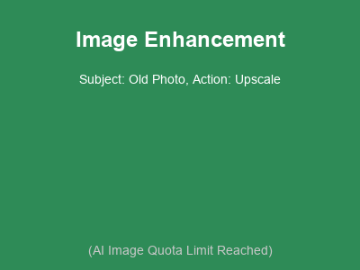
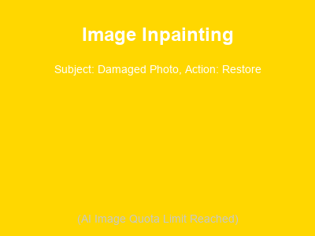

# 商業應用場景

| 應用場景 (Scenario) | 素材 (Materials) | Prompt | 預覽 (Preview) |
| :--- | :--- | :--- | :--- |
| **影像去背景** (Background Removal) |  | **主體:** 產品攝影 **動作:** 去除背景 **效果:** 透明背景, 突顯主體 |  |
| **影像合併** (Image Merging) |  | **主體:** 城市與森林 **動作:** 雙重曝光合併 **效果:** 夢幻, 虛實交錯 |  |
| **影像轉換** (Image Conversion) |  | **主體:** 真人照片 **動作:** 轉換為動漫風格 **效果:** 2D渲染, 線條化 |  |
| **影像風格轉換** (Style Transfer) |  | **主體:** 風景照 **動作:** 套用梵谷星空風格 **效果:** 油畫質感, 漩渦筆觸 |  |
| **影像增強** (Image Enhancement) |  | **主體:** 低解析度舊照 **動作:** 畫質修復與放大 **效果:** 高解析度, 細節清晰 |  |
| **影像修復** (Image Inpainting) |  | **主體:** 破損照片 **動作:** 填補缺失區域 **效果:** 完美還原, 無痕修復 |  |
