## 常見的風格描述(prompt使用)

### 1. 藝術流派 (Art Movements)
- **Impressionism (印象派)**
  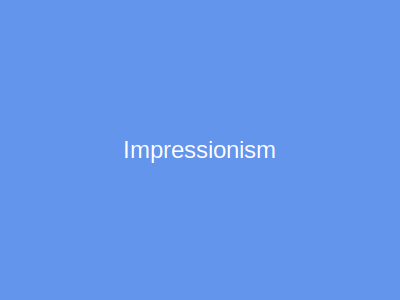
- **Surrealism (超現實主義)**
  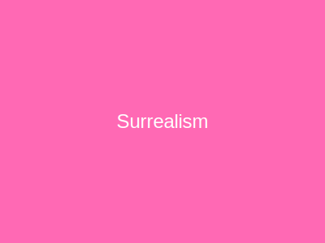
- **Abstract (抽象派)**
  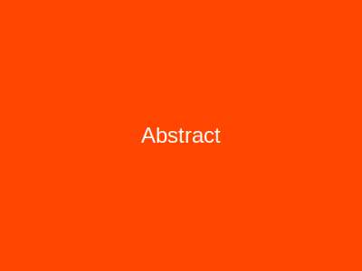
- **Ukiyo-e (浮世繪)**
  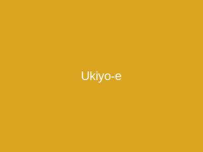
- **Art Nouveau (新藝術運動)**
  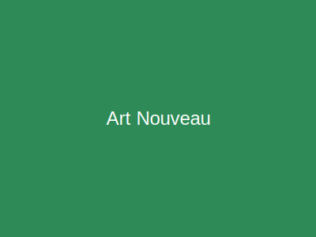
- **Pop Art (普普藝術)**
  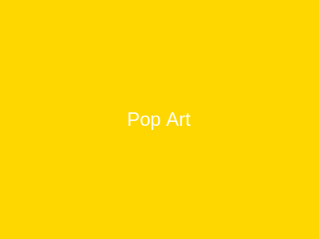

### 2. 數位藝術 (Digital Art)
- **Cyberpunk (賽博龐克)**
  
- **Steampunk (蒸氣龐克)**
  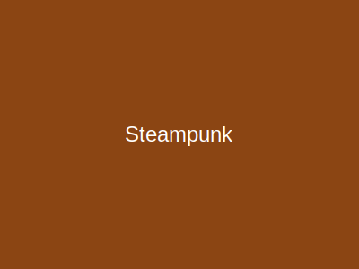
- **Pixel Art (像素藝術)**
  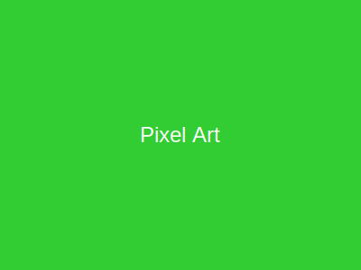
- **Low Poly (低多邊形)**
  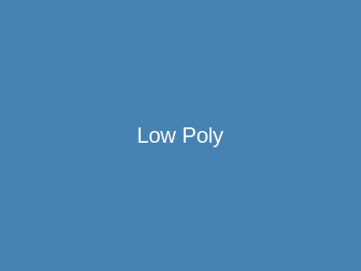
- **Vector Art (向量圖)**
  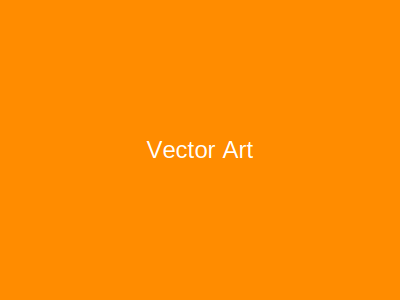
- **Anime/Manga (動漫/漫畫)**
  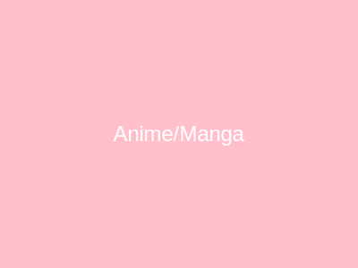
- **Synthwave (合成波)**
  

### 3. 攝影風格 (Photography Styles)
- **Cinematic Lighting (電影光效)**
  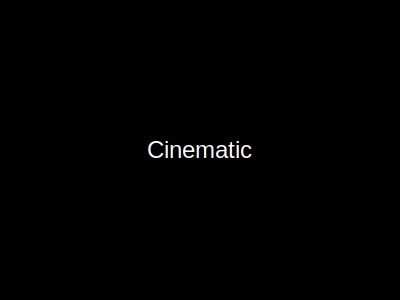
- **Macro Photography (微距攝影)**
  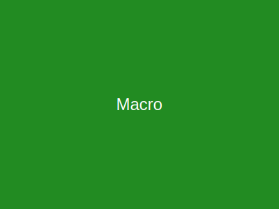
- **Long Exposure (長曝光)**
  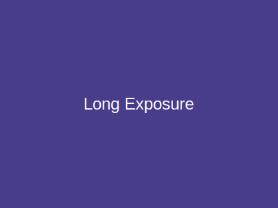
- **Bokeh (散景)**
  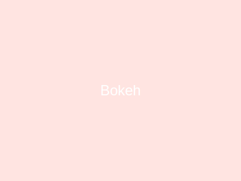
- **Polaroid (拍立得)**
  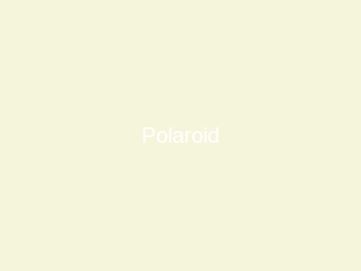
- **Drone View (無人機視角)**
  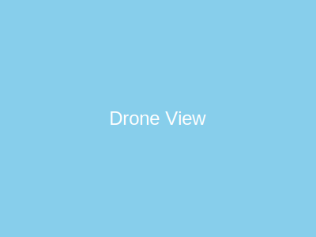

### 4. 渲染與材質 (Rendering & Materials)
- **Unreal Engine 5 (虛幻引擎5)**
  
- **Octane Render (Octane渲染)**
  
- **Isometric (等距視角)**
  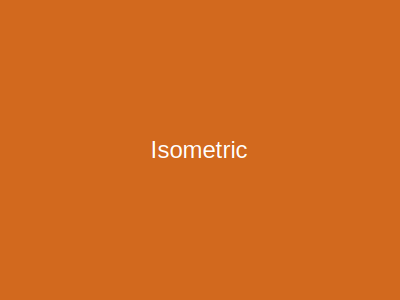
- **Claymation (黏土動畫)**
  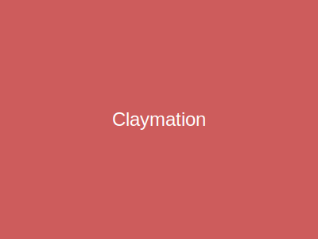
- **Origami (摺紙)**
  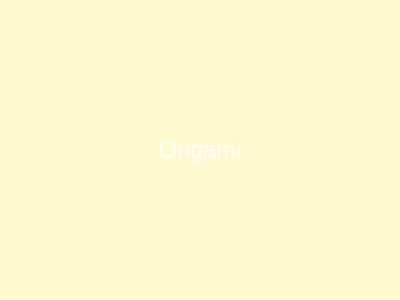
- **Stained Glass (彩繪玻璃)**
  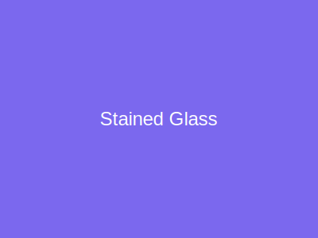

### 5. 插畫風格 (Illustration)
- **Watercolor (水彩)**
  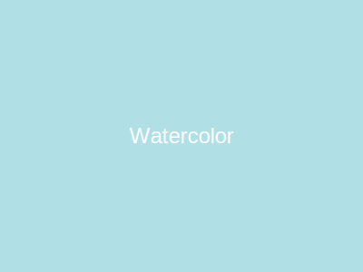
- **Oil Painting (油畫)**
  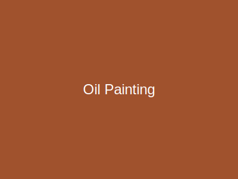
- **Ink Wash Painting (水墨畫)**
  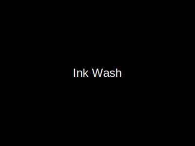
- **Line Art (線稿)**
  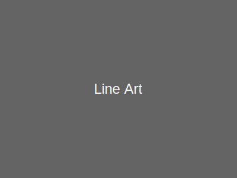
- **Concept Art (概念藝術)**
  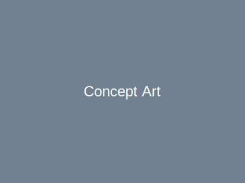
- **Children's Book Illustration (童書插畫)**
  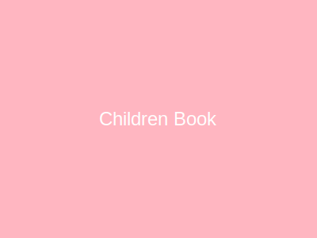