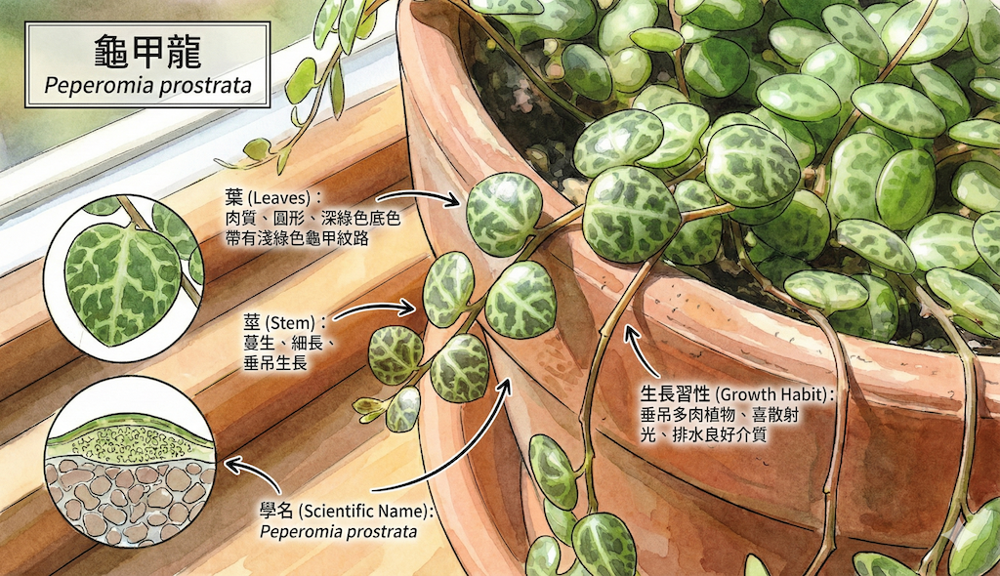
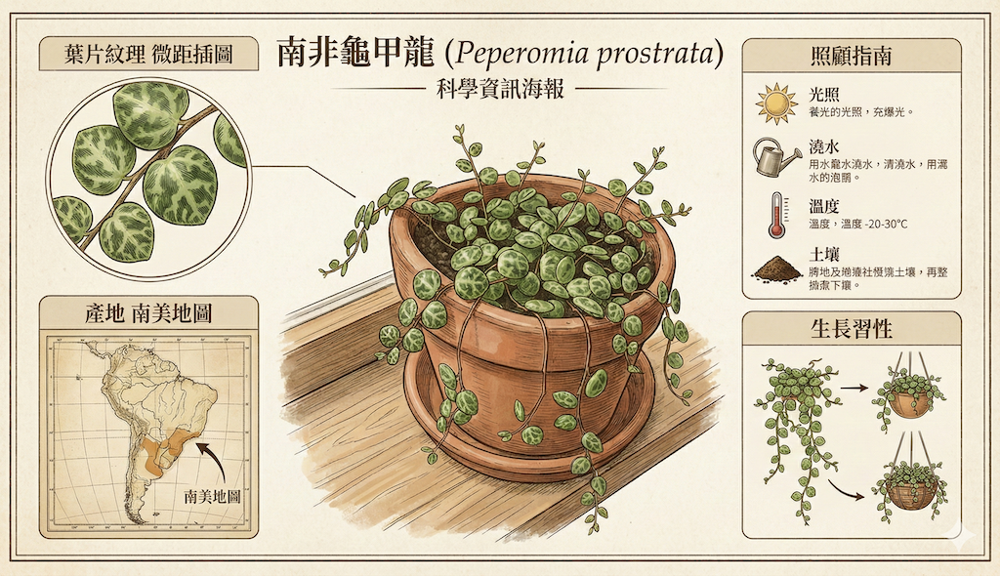
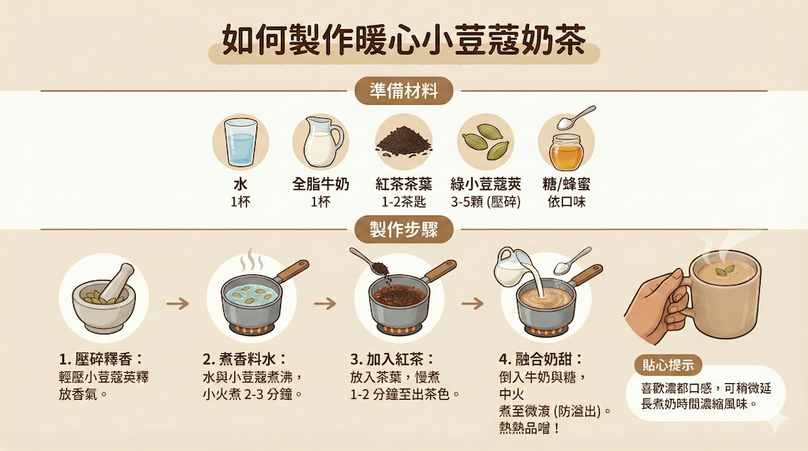

# 推理能力和真實世界

憑藉Gemini 3的先進推理能力，Nano Banana Pro不僅能創造精美圖像，更能協助您產出更具實用價值的內容。您可獲得精準的教育解說文案，深入探索新領域知識——例如根據您提供的內容或現實世界事實，生成富含背景資訊的資訊圖表與示意圖。

## 範例:

一張關於常見室內植物「南非龜甲龍」的資訊圖，包括其原產地、養護要點和生長習性。

**簡易prompt**

```
建立一個有關於這個植物的圖解,必需有這個植物的相關資訊
```


| 來源 | 圖解 |
|:--|:--|
|  |   |


**詳細prompt**

```
## 1. 主題定義 (Subject):
- 植物學資訊海報
- 植物名稱:南非龜甲龍

## 2. 中央視覺 (Central Visual):
- 描述主圖：從陶盆垂下、在木窗台。

## 3. 佈局與區塊 (Layout & Panels):(獨立的資訊區塊)
- 微距插圖 -> 用於葉片紋理。
- 南美地圖 -> 用於產地。
- 圖示 -> 用於照顧指南。
- 圖示 -> 生長習性

## 4. 風格 (Style):
- 復古科學教科書 和 乾淨的米色背景
```

| 來源 | 圖解 |
|:--|:--|
|  |   |


## 範例:

一步一步教你製作小荳蔻茶（Elaichi Chai），用資訊圖表展示食譜和實際操作資訊。

**prompt**

```
製作一張資訊圖，展示如何製作小荳蔻奶茶。
```

   
 
 **詳細prompt**
 
 ```
**一張標題為「如何製作小荳蔻奶茶」的專業、逐步式橫向資訊圖表。**

**[結構]：** 分為三個水平區塊。

- **頂部區塊：** 一排標示為「食材的簡約扁平化圖示：水杯、牛奶杯、茶葉、綠豆蔻莢、糖匙、薑。

- **中間區塊（主要流程）：** 5 個有編號的步驟，顯示烹飪過程並用箭頭連接。插圖內容包含：用研缽與研杵搗碎豆蔻、爐子上的鍋子正在煮水（藍色液體）、加入茶葉（轉為褐色液體）、倒入牛奶（乳白色液體）、小火慢燉，以及最後將茶通過濾網濾入杯中。

- **底部區塊：** 一個深色的橫條區塊，標題為「完美奶茶的秘訣」。

**[風格與配色]：** 向量插畫風格，線條俐落，扁平化設計。採用暖色調配色，包含米色背景、大地棕、深橘色和萬壽菊黃。

**[裝飾]：** 圖片的角落裝飾著精細繁複的印度花卉圖騰（萬壽菊風格）。高解析度，兼具教育性與美感。

**[比例]:** 16:9
 ```
 
 


