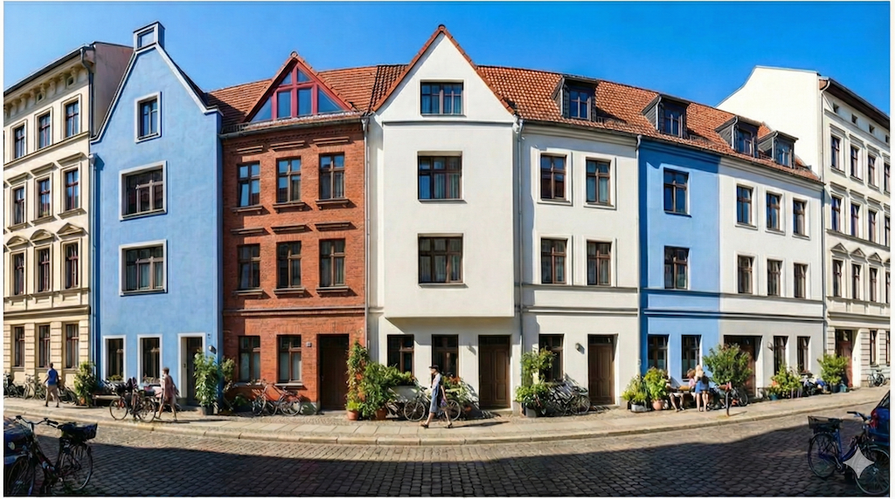
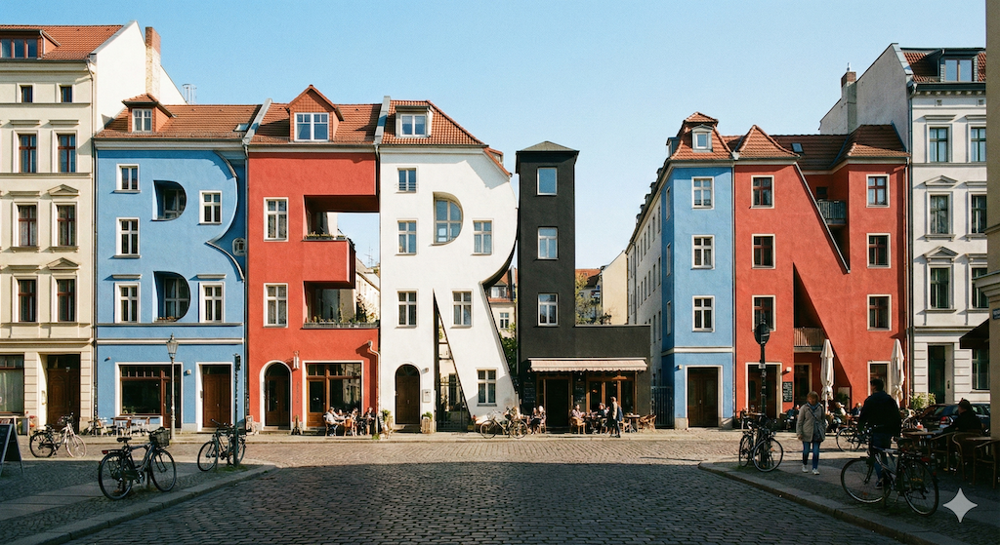
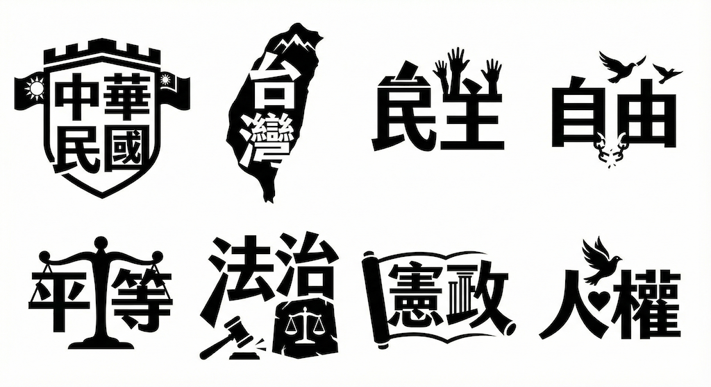
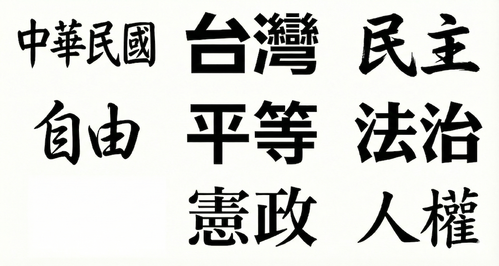

# 文字處理能力

Nano Banana Pro 是最適合在圖像中直接創建具有正確渲染和清晰文字的模型的，無論您是尋找簡短標語還是長篇段落。Gemini 3 在理解深度和細微差別方面表現出色，這為圖像編輯和生成開啟了無限可能——尤其是在文字方面。現在，您可以使用更多樣化的紋理、字體和書法，在模型或海報中創建更詳細的文字。憑藉 Gemini 增強的多語言推理能力，您可以生成多種語言的文字，或將您的內容本地化和翻譯，以便您可以在國際上擴展和/或更輕鬆地與親朋好友分享內容。

## 範例(多國文字能力)

**prompt**

```
## 建立一個黑白故事板草圖

- 展示了電影場景中的一個鏡頭：遠景鏡頭、中景鏡頭、特寫鏡頭和主觀鏡頭。
- 使用2種字體：繁體中文和德文字體
```

| 來源 | 圖解 |
|:--|:--|
|  |   |

## 範例(文字合成)

**prompt**

```
提示：在一個陽光明媚的日子，柏林一條舒適街道的景色，鮮明的陰影。老房子奇形怪狀地像字母，拼出「BERLIN」，塗有藍、紅、白和黑色的顏色。房子仍然看起來像房子，與字母的相似之處是微妙的。
```

| 來源 | 圖解 |
|:--|:--|
|  |   |


## 範例(文字字型)

**prompt**

```
## [主題:]中文字型的表現能力

- 使用繁體中文的8種不同字體
    - 黑體
    - 圓體
    - 明體
    - 手寫體
    - 書法字體
    - 藝術字體
- 構圖：所有標誌以黑色平面向量渲染在單一白色背景上
```



---

## 範例(排版能力)

```
# [主題:]文字組合排版

## [內文1:]
[大標:]Nano Banana Pro 如何幫助您將任何想法或設計變為現實
[中標:]中文字型
[內文:]Nano Banana Pro 可以幫助您將任何想法視覺化，並設計任何內容——從原型到將資料表示為資訊圖表，再到將手寫筆記轉換為圖表。

## [內文2:]
[大標:]How Nano Banana Pro helps you bring any idea or design to life
[中標:]英文字型
[內文:]Nano Banana Pro can help you visualize any idea and design anything — from prototypes, to representing data as infographics, to turning handwritten notes into diagrams.

## [注意事項:]
- 請使用上面2個內文
- 請使用16:9版面
- 左右構圖
- 請將內文排版精美和專業

```



---

